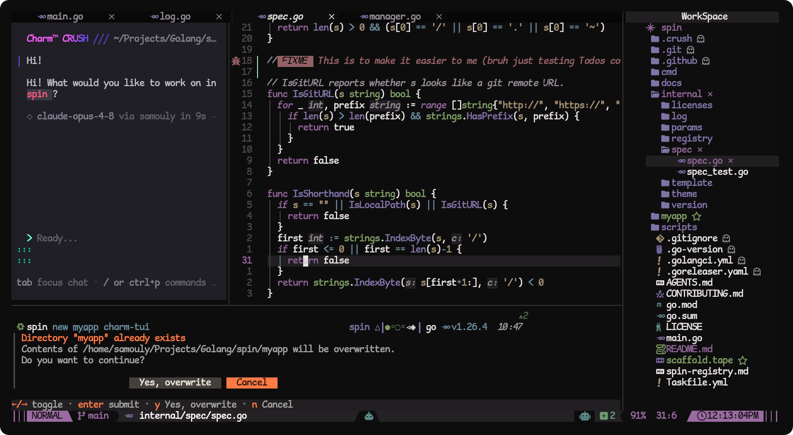

# SamoulyVim, **\# VIM.**

<div align="center">


[](https://github.com/neovim/neovim)


</div>

## Installation

### Prerequisites

- Neovim >= 0.9.5
- Tmux >= 3.2 (optional, for tmux integration)
- `gcc`, `make`, `clang` for Mason to compile and build LSPs

> [!WARNING]
> for language specific LSPs you need to install its stuff for example NodeJS related LSPs needs npm to be installed
> list of needed language specific deps: `npm/nodejs`, `go`, `gcc`, `make`, `unzip`, `tar`.

### Quick install

Please follow these steps:

1. **Preparation**:
   - Ensure that Neovim is not running.
   - Remove or move your current `nvim` directory (if it exists).

> [!NOTE]
> The installer takes care of Backing up your old nvim config or overwrites it.

2. **Installation**:
   - On Linux/MacOS:

```sh
 bash <(curl -s https://raw.githubusercontent.com/N1xev/SamoulyVim/main/install.sh)
```

- On Windows (Powershell):

```ps1
 Invoke-WebRequest https://raw.githubusercontent.com/N1xev/SamoulyVim/main/install.ps1 -UseBasicParsing | Invoke-Expression
```

The installer will:

- Detect your package manager (Linux: paru/yay, Windows: winget/choco)
- Force install essential tools: opencode, ripgrep, fd, lazygit
- Let you select which languages to install: Go, Rust, Node.js, Python

### Nix/OS Installation

Since i have flake.nix file we can install it with some ways:

- test it with `nix run`:

```sh
nix run github:N1xev/SamoulyVim
```

- the flakes way:

1. in your flake.nix:

```nix
{
  inputs = {
    nixpkgs.url = "github:nixos/nixpkgs/nixos-unstable";
    samoulyvim.url = "github:N1xev/SamoulyVim";
  };

  # ... inside your outputs
}
```

2. add it to your home.packages:

```nix
home.packages = [
  inputs.samoulyvim.packages.${pkgs.system}.default
];
```

After switching your home-manager config, run `slvim` in your terminal.

- installing it system-wide:

1. add it as flakes input as shown above

2. add it to your `configuration.nix`:

```nix
environment.systemPackages = [
  inputs.samoulyvim.packages.${pkgs.system}.default
];
```

> [!NOTE]
> Currently the config goes into your `/nix/store` and we have an isolated binary `slvim`

### Manual Installation

If you prefer manual setup:

#### Package Managers

```sh
# Arch Linux with yay:
yay -S opencode ripgrep fd lazygit go rust nodejs python

# Arch Linux with paru:
paru -S opencode ripgrep fd lazygit go rust nodejs python

# Windows with winget:
winget install opencode ripgrep fd lazygit Go.Go Rustlang.Rust OpenJS.NodeJS Python.Python.3

# Windows with Chocolatey:
choco install opencode ripgrep fd lazygit go rust nodejs python
```

#### Neovim Setup

1. Clone this repository:

```bash
git clone https://github.com/N1xev/SamoulyVim ~/.config/nvim
```

2. Start Neovim:

```bash
nvim
```

3. Lazy will automatically install all plugins and dependencies.

## Some features need a manual setup.

Currently i supported [gh-dash](https://gh-dash.dev) it have a [port](https://github.com/johnseth97/gh-dash.nvim) for neovim so its very good to add.

### Prerequisites:

its a github-cli plugin so we need to install `gh` first:

```sh
# Arch with yay
yay -S github-cli

# Arch with paru
paru -S github-cli

# windows with winget
winget install Github.Cli

# windows with Chocolatey
choco install Github.cli
```

> [!WARNING]
> you need to login with `gh auth login` with your github account to install any `gh` extension

### gh-dash installation

first we need to install it by `gh extension`

```sh
gh extension install dlvhdr/gh-dash
```

now you can test it in your terminal with:

```sh
gh dash
```

and in NeoVim with: `<leader>gu`

## Themes

SamoulyVim includes multiple custom themes:

- Azure Depth
- Desert Sunset
- Forest Whisper
- Lavenadr Dreams
- Nahody
- Samtone
- Tailsvim
- Volcanic Ash
- and alot of other great themes, pick what makes your eyes comfortable :)

Themes automatically sync with tmux colors. Switch themes with `:Telescope colorscheme` or `:colorscheme <theme>`.

## Supported Languages

- **Go**: LSP, debugging, testing, formatting
- **Rust**: LSP, debugging, cargo integration
- **TypeScript/JavaScript**: LSP, formatting
- **Python**: LSP, linting (install python-lsp-server)

## Documentation

Refer to [LazyVim documentation](https://lazyvim.github.io/installation) for general usage.

### Key Bindings

- `<leader>e`: Toggle nvim-tree
- `<leader>o`: OpenCode commands
- `<leader>f`: Telescope find files
- `<leader>u`: UI related commands

## 🤝 Contributing

Contributions welcome! Please open issues or pull requests.

## 📄 License

Apache v2 License - see LICENSE file for details.
